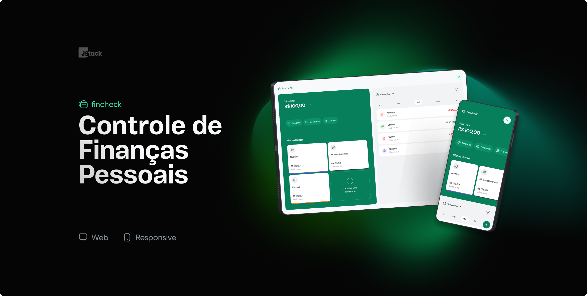

<div align="center">
  <h1>Fincheck<h1/>
</div>



# Features
- User registration, authentication, and password recovery
- Listing, creation, update, and deletion of bank accounts
- Listing, creation, update, and deletion of transactions (income and expenses)

# Technologies Used

## Front-end
- React.js
- Typescript
- Tailwind CSS
- Radix UI
- Headless UI
- React Query
- Axios

## Back-end
- NestJS
- Prisma
- PostgreSQL
- REST API

# How to Run
Before getting started, make sure you have the following tools installed on your machine:
- Node.js
- Docker
- Git

You will need to install project dependencies for the back-end, which is located in the `/api` directory. After that, you can run it, and then install and run the front-end dependencies located in the `/frontend` directory.

## Running the Back-end
```bash
$ git clone https://github.com/eric-vantunes/fincheck.git

$ cd fincheck/api

$ docker compose up -d

$ npx prisma migrate dev

$ yarn install # or npm install

$ yarn start:dev # or npm run start:dev

```
## Running the Front-end
```bash

$ cd fincheck/frontend

$ yarn install # or npm install

```
Here, you will need to create an `.env` file following the example in the `.env.example`.

```bash

$ yarn dev # or npm run dev

```